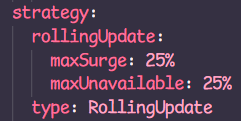
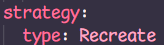
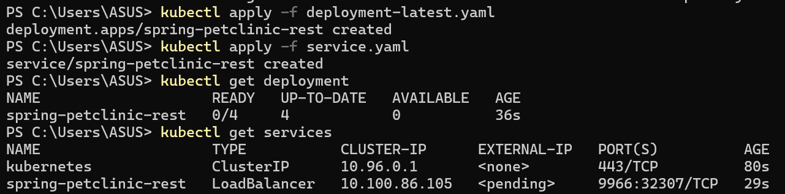

# adpro-tutorial11

1. Compare the application logs before and after you exposed it as a Service. 
Before the application was exposed as a service, the application logs didn't have anything but messages saying that it's started the servers. Afterwards, it shows that several GET requests were made to the application.

2. Notice that there are two versions of kubectl get invocation during this tutorial section. The first does not have any option, while the latter has `-n` option with value set to kube-system. What is the purpose of the `-n` option and why did the output not list the pods/services that you explicitly created? 
`-n` stands for namespace. Namespaces in kubernetes provide a mechanism for isolating groups of resources in a single cluster, which is useful when you have environments with many users used by many teams and many projects. Without the `-n`, the output will list the pods and services I've created explicitly in the default namespace. With the `-n kube-system` the command is asking to list the pods and services in the kube-system namespace specifically. The kube-system namespace is the namespace for objects created by Kubernetes.

#### Reflection on Rolling Update & Kubernetes Manifest File
1. What is the difference between Rolling Update and Recreate deployment strategy? 
Rolling updates means it increments the updates and replaces old instances of the application slowly, in small batches. There's no downtime here because the old instance is still available as it's updating. Recreate deployment means scrapping the old instance and replacing it with a brand new one. This method involves downtime because there will be a period where the application is completely unavailable because the old instance is being terminated while the new instance is being started.
2. Try deploying the Spring Petclinic REST using Recreate deployment strategy and document your attempt.

Creating a new deployment, exposing the service, scaling it, and editing the deployment:

Recreate means deleting old pods:

3. Prepare different manifest files for executing Recreate deployment strategy.
Make the deployment file by changing the strategy type to Recreate as you can see in my deployment-latest.yaml file.
From this:

To this:

And then apply the manifest file to deploy it like at the end of the previous part of the tutorial:

4. What do you think are the benefits of using Kubernetes manifest files? Recall your experience in deploying the app manually and compare it to your experience when deploying the same app by applying the manifest files (i.e., invoking `kubectl apply -f` command) to the cluster.  
Doing it manually means I have to remember the sequence of commands I have to invoke to deploy an app. With the manifest files, it essentially does the work for me, so I don't have to remember and type the commands one by one. This will speed up processes and make things much more convenient.
